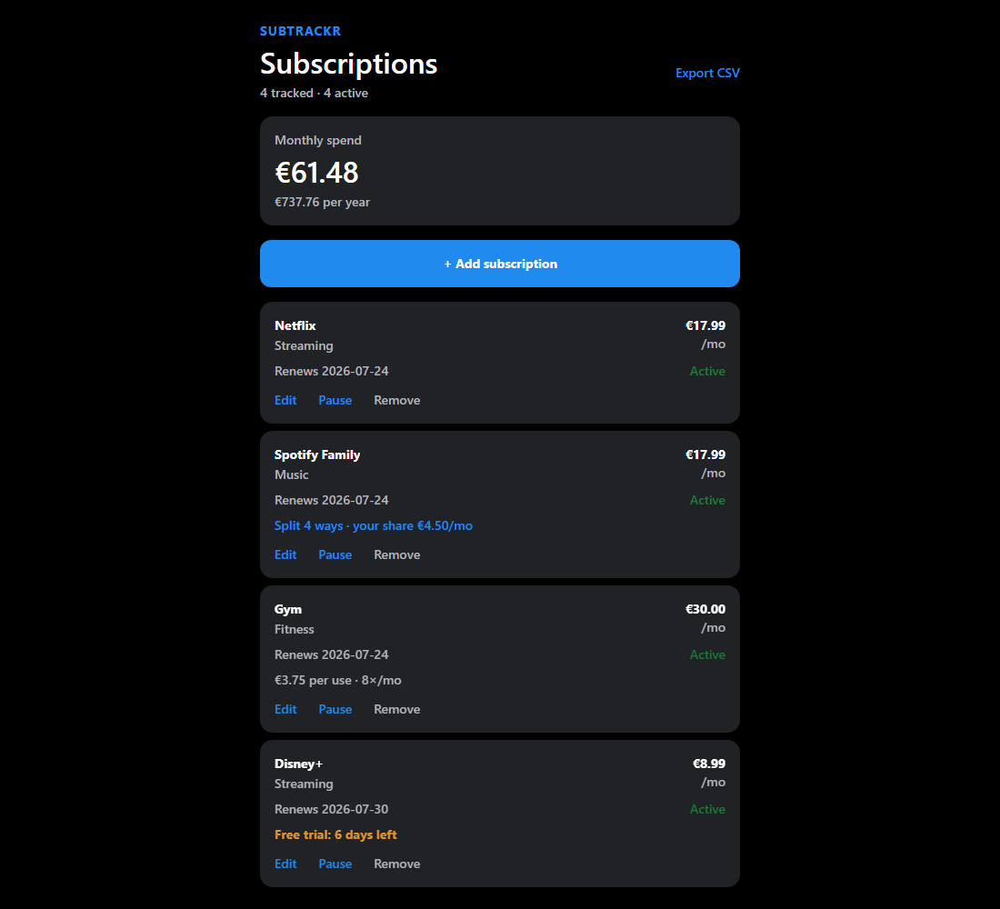
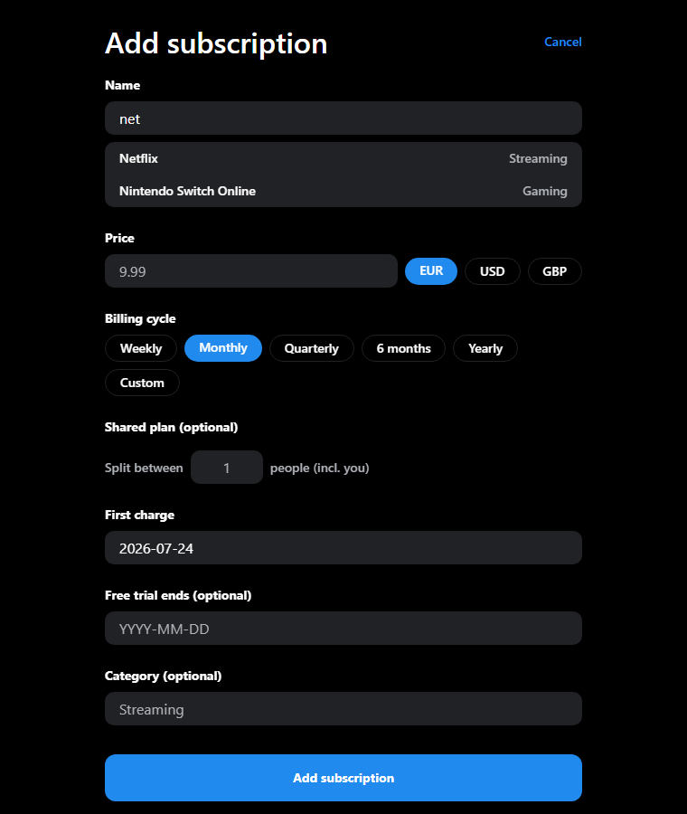
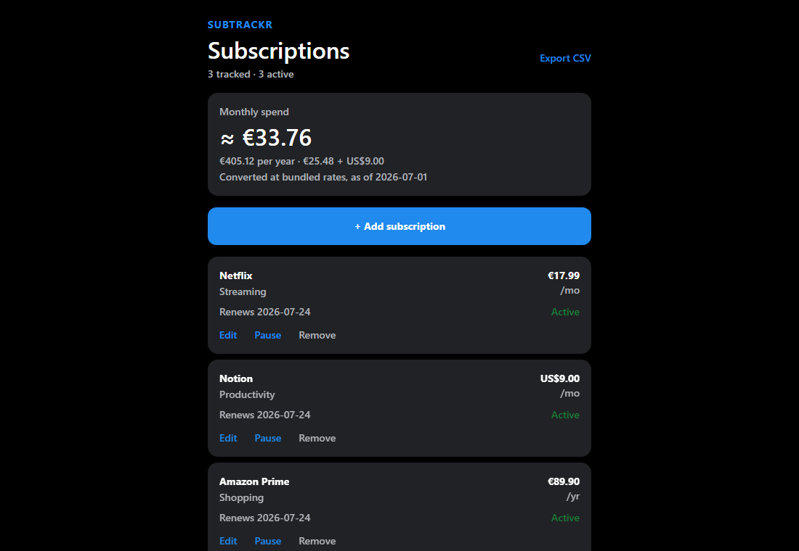

<div align="center">

# Subtrackr

**The privacy-first subscription tracker that kills data-entry friction, without ever seeing your data.**

[](./LICENSE)
[](https://conventionalcommits.org)
[](#quality)
[](#quality)



</div>

## Why Subtrackr

Manual trackers like Bobby and Subby respect your privacy but make you type everything by hand. Bank-linked trackers like Rocket Money remove the typing but ingest your financial data through Plaid.

Subtrackr removes the typing **and** keeps everything on your device. No bank link. No account. No server that sees your data.

## What it does

- **Smart catalog quick-add.** Start typing a name and pick from ranked suggestions that autofill price, currency, cycle, and category.
- **Spend at a glance.** Monthly and yearly totals, converted to a single base currency using bundled offline rates (with the rate date disclosed), or grouped per currency.
- **Shared-plan splitting.** Track a family plan split N ways and see your real share, which also feeds the spend total.
- **Free-trial countdowns.** See exactly how many days remain to cancel before a trial charges you.
- **Cost-per-use.** Log how often you use a service to reveal its true cost per use.
- **Full lifecycle.** Add, edit, pause, resume, cancel, and remove, all persisted locally.
- **Data portability.** One-tap CSV export (RFC-4180, round-trips exact amounts).

| Add from the catalog                                                                                 | One total across currencies                                                                                |
| ---------------------------------------------------------------------------------------------------- | ---------------------------------------------------------------------------------------------------------- |
|  |  |

## Status

Pre-release. **v1 is feature-complete on web** and runs against a local `localStorage`-backed store.

| Area                           | State                                                                                      |
| ------------------------------ | ------------------------------------------------------------------------------------------ |
| Web (PWA via react-native-web) | Working, primary verified target                                                           |
| iOS / Android (Expo)           | Builds from the shared code; native storage, OCR, and push notifications are not wired yet |
| On-device OCR                  | Deferred (the heavy, platform-specific half of the wedge)                                  |
| CI/CD                          | Authored but gated off until Actions credits are available                                 |
| Store publishing               | Pending Apple/Google developer accounts                                                    |

## Architecture

A pnpm monorepo built as hexagonal ports and adapters, so the pure domain runs anywhere and adapters plug into it.

```
packages/
  domain/        pure TS: value objects (Money, DateOnly, BillingCycle), Subscription,
                 feature registry, ports (Repository, Clock, IdGenerator, KeyValueStore, Rates),
                 analytics, CSV export, bundled rates
  application/   SubscriptionService use cases over the ports
  persistence/   in-memory + localStorage-backed repositories (one shared contract test)
  catalog/       bundled service catalog + ranked fuzzy search
apps/
  mobile/        Expo (SDK 57) app, iOS / Android / Web from one codebase
```

The domain core imports no framework or platform code (enforced by dependency-cruiser), which is what keeps it portable and mutation-testable.

## Quality

- **397 tests**, 100% coverage across all logic packages.
- **Property-based** tests (fast-check) and **mutation testing** (Stryker) on the money and date math, the feature registry, and the catalog search.
- TypeScript strict, ESLint, Prettier, Conventional Commits, Changesets, and Husky hooks that run the full gate before every push.

See [`docs/`](./docs/README.md) for the living PRD, tech spec, architecture decision records, and the [work ledger](./WORK_LEDGER.md).

## Running it

```bash
# prerequisites: Node >= 20, pnpm >= 9
pnpm install
pnpm verify                        # lint + typecheck + tests + coverage (the local gate)
pnpm --filter @subtrackr/mobile web   # run the app in a browser
```

Full guide: [docs/process/contributing.md](./docs/process/contributing.md).

## License

[PolyForm Noncommercial 1.0.0](./LICENSE). Source is public for study and non-commercial use; commercial rights are reserved by the author.
